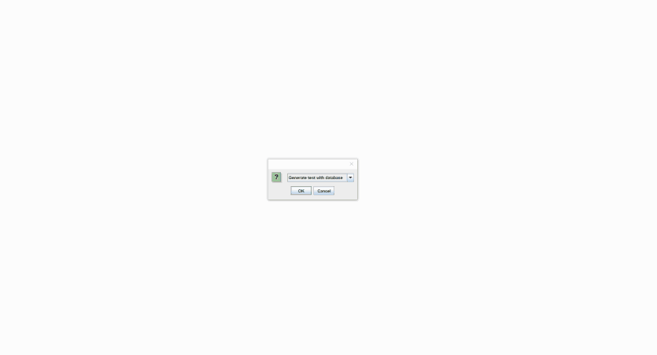
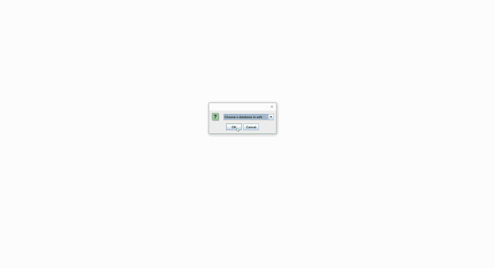

# Test-Assistant
The Test-Assistant program allows the user to edit or create a database question within their file explorer/finder. The user may then choose from these databases and generate a test of their desired format and export the test to a PDF document. 

The Test-Assistant program is designed for teachers to store and create tests efficiently. The program has been divided into two sub-programs. 

Functionality 

Database Manager 
 - May be used to create a new database of questions (a new unit for an example) by saving the questions on a .txt file 
 - As well, may add or edit questions to an existing database. 
 Test Manager
 - Randomly generates desired number of each type of question (knowledge, communication, thinking, application) from pre-existing database
 - May also edit/add questions within the GUI similar to the database manager
 - Added function to rename the test and regenerate an entirely new set of questions 
 - Finally, may export the test questions to a PDF document 
 
 Using the Database Manager to add and edit short questions within the GUI 
 
 
 Using the Database Manager to add and edit multiple choice questions within the GUI
 
 
 Using the Test Manager to generate and regenerate a test. Then exporting it to an external PDF document
  
 
 Created using IText API
 
